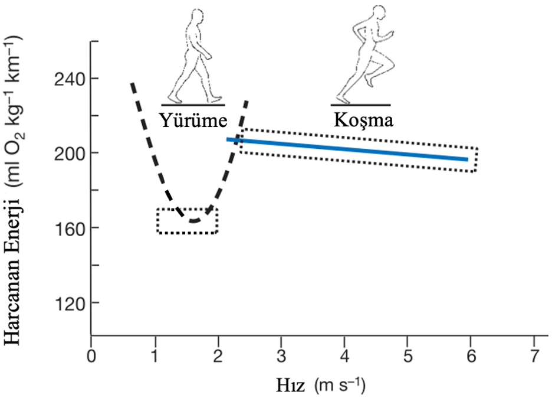

Gelin bundan bir milyon yıl önceye gittiğimiz bir düşünce deneyi yapalım. Ailemizin de dahil olduğu 40-50 kişilik bir kabileyle yaşıyoruz. Hayatta kalmak için iki temel amacımız var; bir sonraki ogünümüzü bulmak, ve başka bir hayvanın bir sonraki öğünü olmamak. Hayvanları öldürecek alet ve edevatımız yok. Bu yüzden çoğunlukla bitkilerle, bulabilirsek de ölü hayvan artıklarıyla besleniyoruz. Hayvanların etleri ve kemik ilikleri bitkilere göre daha kalorili ve daha doyurucular. Değerli oldukları için yerlerini tespit etme yöntemleri geliştirdik. Akbabaların ölen hayvanların üzerinde uçtuğunu biliyoruz ve gün içinde dinlendiğimiz yerleri yüksek tepeler seçiyoruz ki sürekli gökyüzündeki kuşları gözlemleyebilelim. 

Bir gün gökyüzüne bakarken birkaç tane akbabanın 10 - 15 km ötede dönerek uçtuğunu fark ettik. Şimdiye kadar birden fazla akbabanın bu şekilde kümelendiğini gördüğümüzde, ölen hayvan bizi 2 - 3 gün doyuracak büyüklükte olmuştu. Mutlu bir gerginlik hissediliyor kabilede. Mutluyuz çünkü bir sonraki öğünümüzü tespit ettik, gerginiz çünkü öğünümüze giden süreçte başka bir hayvanın öğünü olmamamız gerekiyor.

Elimizden geldiğince hızlı bir şekilde akbabaları gördüğümüz alana gittikten sonra başka hayvanların ya da başka bir kabilenin henüz gelmediğini gördük. Bir an önce hayvanı güvenli bir alana çekip yiyoruz. Bu sefer şansımız yaver gitti.

Bir milyon yıl sonraya geldiğimizde, bu düşünce deneyimizde yaşanan senaryoların, atalarımızın günümüzdeki insana evrilmesinde önemli bir rol oynadığını savunan bilim insanları var. Bu bilim insanlarından biri de Daniel Lieberman. Lieberman, atalarımızın fosillerini insanların anatomisiyle kıyaslayıp uzun mesafe koşularının insanların seçilmesinde önemli bir rol oynadığını savunuyor. İnsan vücudunda gelişmiş ve uzun mesafe koşularıyla ilişkilendirilebilecek özellikleri birkaç ana başlıkta toparlamış; iskeletimizin güçlülüğü, koşarkenki stabilizasyonumuz, vücut sıcaklığımızı düzenleyen mekanizmaların gelişmiş olması ve koşarken enerji tasarrufu yapmamızı sağlayan anatomik yapılarımız [1].

Koşarken enerji tasarrufu yapmamızı sağlayan özelliklerin başında ayaklarımız ve bacaklarımızda yay görevi gören uzun tendonlarımızın olması var. Tendonlarımız koşarken attığımız darbeli adımlar sırasında enerjiyi emmek yerine, depolayıp bir sonraki adımda tekrar kullanmamızı sağlıyor. Yine benzer şekilde ayağımızın altındaki kemer de koşarken yay görevi gören bir başka yapı. Bu tarz adaptasyonlar bir yandan enerjimizi daha verimli kullanmamızı sağlarken, büyüyen beynimiz ve artan mobilitemiz de daha fazla enerji ihtiyacı doğurmuş [1].

Artan enerji ihtiyacımızı vücudumuzda daha fazla yağ depolamaya başlayarak çözmüşüz. Fosillerde yağ oranı analizi yapamadığımız için en yakın akrabamız olan bonobolara bakarak ortak atalarımız hakkında fikir edinebiliyoruz. Bonobolar, yeni doğum yapan dişileri saymazsak, vücut ağırlıklarının %2-3’ü kadar yağ depoluyorlar. Bilim insanları bu tarz araştırmalardan yola çıkarak soyu tükenen akrabalarımızdan Homo Erectus’un vücut ağırlığının %7-8’inin yağ dokusu olduğunu tahmin ediyor [2].

Milyonlarca yıldır hayatta kalmamız için metabolizmamızı en uygun hale getiren evrim, günümüzde enerjiye ulaşımımızın kolaylaşmasıyla hayatımızı zorlaştırıyor. Aslında metabolizmamızı miras aldığımız atalarımızın hayatını düşündüğümüzde, günün büyük bir kısmında enerji harcamamak için dinleniyorlardı. Geri kalan kısmında ya bitki toplamak için yürüyüş yapıyor ya da fırsat buldukça uzun mesafeler koşarak hayvan artıklarıyla besleniyorlardı. Bu hayatı günümüze uyarladığımızda, masa başında çalışan kişiler ya da öğrenciler enerji harcama açısından bakıldığında günün çoğunda dinleniyor. Peki geri kalan kısıtlı vaktimizde uzun yürüyüşleri ya da koşuları kısaltıp yine de o Frappuccino’yu hak edebilir miyiz?

Her ne kadar vücudumuz elinden geldiğince az enerji kaybetmek istiyor olsa da onu kadırmak için günlük hayatımızda ufak değişiklikler yapabiliriz. Tam olarak nedeni henüz açıklanamamış olsa da, yürürken belli bir adım sayısını, 140 adım/dk, ve yürüyüş hızını, 2 - 2.5 m/s, geçtiğimizde otomatik olarak koşmaya başlıyoruz [3]. Aşağıdaki grafikte çeşitli yürüyüş ve koşu hızlarında belli bir mesafeyi gitmek için kullandığımız oksijen miktarı gösterilmiş. Basitleştirirsek, vücudumuzun kullandığı oksijeni harcadığımız enerji gibi düşünebiliriz. Yürüyüş için harcadığımız enerji eğrisinin koşu çizgisiyle kesiştiği hızın 2 - 2.5 m/s aralığı olması, beynimizin daha az enerji harcamak için bu aralıkta yürüyüşten koşuya geçmemizi istediği savını kuvvetlendiriyor. Zira istediğimizde bu hızlardan daha yüksek hızlarda yürüyebiliyoruz. Bunun en iyi örneği yürüyüş yarışları.

2022 yılında yapılan Dünya U20 Atletizm Şampiyonası’nda 10 km yürüyüş dalında birinciliği Mazlum Demir, üçüncülüğü ise yine bir Türk sporcu Hayrettin Yıldız aldı. Mazlum 10 km’yi 42 dakikada, yani yaklaşık 4m/s hızla ‘yürüdü’. Grafikte bu hız için harcanan enerji gösterilmemiş olsa da aynı mesafeyi aynı hızda koşan birinden çok daha fazla enerji harcadığını yürüyüş eğrisinin gidişatından anlayabiliyoruz. Mazlum aşırı bir örnek olsa da, yürüyüş hızımızı artırarak enerji harcama eğrisinin dibinden kurtulabiliriz. Çünkü evrimin bir başka tuzağı da, yürüyüş tempomuzun üzerine düşünmediğimizde, otomatik olarak eğrinin en dibindeki hızla yürüyor olmamız. Yani olabilecek en az enerjiyi harcıyoruz [4]. Tempomuzu ayarlamanın basit bir yolu adımlarımızı saymak. Enerji eğrisinin dibinde yürüyen insanlar bir dakikada ortalama 90 - 110 adım atıyor [5]. Bu sayıyı artırarak bir Mazlum olamayabiliriz ama Postacı Kemal Sunal’a taş çıkartabiliriz.

Sonuç olarak, evrimesel biyologlar yürüme ve uzun mesafe kosma aktivitelerinin insanın evriminde önemli roller oynadığını düşünüyorlar. Bu süreçte hayatta kalmak için en uygun hale gelen metabolizmamız, son birkaç yüzyılda değişen sosyal ve ekonomik düzene ayak uydurmakta zorlanıyor. Vücudumuzun milyonlarca yıl boyunca nasıl ‘yontulduğu’ bilirsek, ona istediğini verebilir ve belki bir dahaki sefer, o 15 dakika yürüyüş mesafesindeki yere arabayla gitmek yerine tempolu bir yürüyüş yapabiliriz. Ya da hafta sonu, doğada uzun bir yürüyüş veya koşu için fırsat yaratabiliriz.

<ins>Kaynakça:<ins>
1.	Bramble, D. M., & Lieberman, D. E. (2004). Endurance running and the evolution of Homo. nature, 432(7015), 345-352.
2.	Zihlman, A. L., & Bolter, D. R. (2015). Body composition in Pan paniscus compared with Homo sapiens has implications for changes during human evolution. Proceedings of the National Academy of Sciences, 112(24), 7466-7471.
3.	Hansen, E. A., Kristensen, L. A. R., Nielsen, A. M., Voigt, M., & Madeleine, P. (2017). The role of stride frequency for walk-to-run transition in humans. Scientific reports, 7(1), 1-8.
4.	A Holt, K. G., Jeng, S. F., Ratcliffe, R., & Hamill, J. (1995). Energetic cost and stability during human walking at the preferred stride frequency. Journal of motor behavior, 27(2), 164-178.
5.	Rowe, D., Welk, G., Heil, D., Mahar, M., Kemble, C., Calabro, M., & Camenisch, K. (2011). Stride rate recommendations for moderate-intensity walking. Medicine and science in sports and exercise, 43(2), 312-318.

